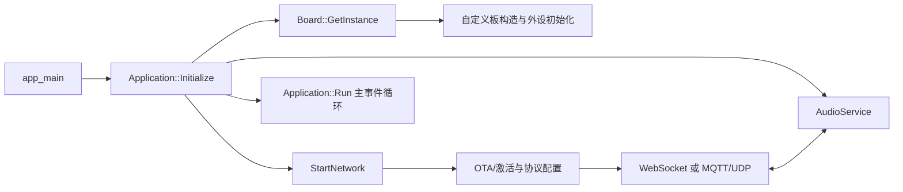

# bread-compact-wifi 硬件定制与本地构建指南

本文面向当前使用 `v2.4.0_bread-compact-wifi` 固件的 ESP32-S3 硬件，内容按本仓库 2.4.0 源码核对。它说明现有固件对应什么硬件、应修改哪些代码、怎样保留独立的板型身份、如何在本地编译和烧录，以及项目主要目录分别负责什么。

> 结论先说：如果新硬件的 GPIO、Flash/PSRAM、音频器件或显示器与原版不同，不要直接改 `main/boards/bread-compact-wifi` 后仍沿用 `bread-compact-wifi` 名称。应复制成一个唯一命名的新板型。`BOARD_NAME` 会参与设备 SKU/OTA 身份，继续使用原名可能让定制硬件收到不兼容的官方 OTA 固件。

## 1. 当前固件到底对应什么

`v2.4.0_bread-compact-wifi` 可拆成：

- `v2.4.0`：根目录 `CMakeLists.txt` 中的 `PROJECT_VER`。
- `bread-compact-wifi`：构建变体名，同时也是此构建的 `BOARD_NAME`。
- 板型实现目录：`main/boards/bread-compact-wifi/`。
- 目标芯片：`esp32s3`。
- 屏幕变体：SSD1306 128×32。

该目录的 `config.json` 定义了两个发布变体：

| 构建命令中的 `--name` | OLED 配置 | 输出压缩包 |
| --- | --- | --- |
| `bread-compact-wifi` | SSD1306 128×32 | `releases/v2.4.0_bread-compact-wifi.zip` |
| `bread-compact-wifi-128x64` | SSD1306 128×64 | `releases/v2.4.0_bread-compact-wifi-128x64.zip` |

默认 ESP32-S3 配置来自 `sdkconfig.defaults.esp32s3`，包括 16 MB Flash、QIO Flash、Octal PSRAM、240 MHz CPU；分区表默认是 `partitions/v2/16m.csv`。因此不能只确认芯片写着“ESP32-S3”，还要确认模块的 Flash/PSRAM 容量和模式与这些默认值一致。

## 2. 当前硬件引脚和行为

引脚定义在 `main/boards/bread-compact-wifi/config.h`，初始化和业务行为在 `main/boards/bread-compact-wifi/compact_wifi_board.cc`。

### 2.1 音频

当前使用 `NoAudioCodecSimplex`：这里的“无 codec”是指没有 ES8311 一类可通过 I²C 配置的硬件 codec，并不是没有音频。它直接连接标准 I²S 数字麦克风和 I²S DAC/功放模块，麦克风与扬声器分别占用一个 I²S 控制器。

| 功能 | GPIO | 方向 | 说明 |
| --- | ---: | --- | --- |
| 麦克风 WS/LRCK | 4 | ESP32-S3 输出 | 输入采样率 16 kHz |
| 麦克风 SCK/BCLK | 5 | ESP32-S3 输出 | 标准 I²S 时钟 |
| 麦克风 DIN | 6 | ESP32-S3 输入 | 麦克风数据进入 ESP32-S3 |
| 扬声器 DOUT | 7 | ESP32-S3 输出 | ESP32-S3 输出音频数据 |
| 扬声器 BCLK | 15 | ESP32-S3 输出 | 输出采样率 24 kHz |
| 扬声器 LRCK/WS | 16 | ESP32-S3 输出 | 标准 I²S 左右声道时钟 |

当前驱动使用单声道、32 bit I²S slot，并默认读取/输出左声道 slot。常见的 INMP441 一类麦克风如果通过 L/R 管脚选择右声道，需要在 `GetAudioCodec()` 中改用带 `i2s_std_slot_mask_t` 参数的重载，并传入 `I2S_STD_SLOT_RIGHT`，否则可能只有静音或数据异常。

不要仅为了少用 GPIO 就随意注释 `AUDIO_I2S_METHOD_SIMPLEX`。Duplex 模式共用 BCLK/WS，收发两端实际必须兼容同一时钟和采样率；当前板型输入标称 16 kHz、输出 24 kHz，改成 Duplex 前必须同时核对器件时序和音频流水线。

### 2.2 OLED

| 功能 | 配置 |
| --- | --- |
| I²C 控制器 | I²C0 master |
| SDA | GPIO41 |
| SCL | GPIO42 |
| 地址 | `0x3C` |
| 速率 | 400 kHz |
| 宽度 | 128 |
| 高度 | 32 或 64，由构建变体选择 |
| 方向 | X、Y 均镜像 |
| Reset | 未接，代码使用 `GPIO_NUM_NC` |

驱动开启了 ESP32-S3 内部上拉，但实际硬件仍建议按 OLED 模块规格配置外部上拉。若屏幕地址是 `0x3D`，修改 `compact_wifi_board.cc` 中 `io_config.dev_addr`。屏幕上下或左右颠倒时，修改 `DISPLAY_MIRROR_X` / `DISPLAY_MIRROR_Y`。

Kconfig 还支持 SH1106 128×64。若自定义板使用它，应在新板型的 `config.json` 中选择 `CONFIG_OLED_SH1106_128X64=y`，不要同时选择多个 OLED 类型。

### 2.3 按键、LED 和 MCP 灯

| 功能 | GPIO | 当前行为 |
| --- | ---: | --- |
| BOOT 按键 | 0 | 启动阶段单击进入 Wi-Fi 配网；正常运行时单击切换对话状态 |
| 按住说话键 | 47 | 按下开始监听，松开停止监听 |
| 音量加 | 40 | 单击 +10；长按设为 100 |
| 音量减 | 39 | 单击 -10；长按静音 |
| 状态 LED | 48 | `SingleLed` 显示设备状态 |
| MCP 示例灯 | 18 | AI 可调用 `self.lamp.get_state/turn_on/turn_off` |

`Button` 默认是低电平有效并启用内部上拉，所以通常是“按键把 GPIO 接到 GND”。如果硬件是高电平有效，要在板类构造函数的成员初始化中显式传 `true`，例如 `touch_button_(TOUCH_BUTTON_GPIO, true)`。不用的按键可在新板型 `config.h` 中设为 `GPIO_NUM_NC`，`Button` 类会跳过创建。

GPIO0 是启动绑带脚。上电或复位时若它被持续拉低，ESP32-S3 会进入下载模式；布线和外部电路必须保证正常启动时不会误拉低。

## 3. 推荐的定制方式：创建独立板型

以下示例把新板命名为 `my-bread-s3`。实际使用时请改成能长期保持唯一的名字，例如“品牌-产品-硬件版本”，不要在以后把同一个名字复用给引脚不兼容的硬件。

### 3.1 复制并重命名目录

在项目根目录执行：

```powershell
Copy-Item -Recurse main\boards\bread-compact-wifi main\boards\my-bread-s3
Rename-Item main\boards\my-bread-s3\compact_wifi_board.cc my_bread_s3_board.cc
```

然后修改新目录，原目录保持不动：

```text
main/boards/my-bread-s3/
├── config.h
├── config.json
├── my_bread_s3_board.cc
└── README.md              # 建议补充原理图版本、物料和接线说明
```

在 `my_bread_s3_board.cc` 中至少完成类名、构造函数名和工厂注册重命名：

```cpp
class MyBreadS3Board : public WifiBoard {
    // 保留并按硬件修改原来的成员和初始化函数

public:
    MyBreadS3Board() :
        boot_button_(BOOT_BUTTON_GPIO),
        touch_button_(TOUCH_BUTTON_GPIO),
        volume_up_button_(VOLUME_UP_BUTTON_GPIO),
        volume_down_button_(VOLUME_DOWN_BUTTON_GPIO) {
        InitializeDisplayI2c();
        InitializeSsd1306Display();
        InitializeButtons();
        InitializeTools();
    }
};

DECLARE_BOARD(MyBreadS3Board);
```

一个构建最终只能出现一次 `DECLARE_BOARD(...)`，否则会产生重复的 `create_board()`。仅改文件名不是必须的，但改名后更容易排查日志和符号。

### 3.2 修改 `config.h`

这里负责纯板级常量：

- I²S 麦克风、扬声器 GPIO 和采样率。
- OLED I²C GPIO、尺寸、镜像方向。
- 按键、状态 LED、MCP 灯 GPIO。
- Simplex/Duplex 音频选择。

修改前先制作一张完整的 GPIO 占用表，并核对：

- GPIO 是否确实从所用模组引出。
- 是否与板载 RGB LED、USB D-/D+、Flash、PSRAM、JTAG 或启动绑带脚冲突。
- 同一个 GPIO 是否被两个外设重复使用。
- 外设电平是否为 3.3 V；不要把 5 V 逻辑直接送入 ESP32-S3。
- 麦克风数据方向、I²S 左/右 slot、功放使能和静音脚是否匹配。

### 3.3 修改板级 `.cc`

这里负责“怎么初始化”和“发生事件时做什么”：

- `InitializeDisplayI2c()`：创建 OLED 的 I²C bus。
- `InitializeSsd1306Display()`：设置地址、速率、控制器类型和方向，创建 `OledDisplay`。
- `InitializeButtons()`：为单击、长按、按下和松开注册行为。
- `InitializeTools()`：注册 GPIO18 灯控示例。
- `GetAudioCodec()`：选择 I²S 模式、采样率、引脚和左右 slot。
- `GetLed()` / `GetDisplay()`：向核心层暴露可选硬件能力。

常见修改方法：

- 不需要 GPIO18 灯控：删除 `InitializeTools()` 的调用和实现，或把 `LAMP_GPIO` 设为 `GPIO_NUM_NC`。
- 更换 OLED 地址：修改 `io_config.dev_addr`。
- 更换按键动作：修改 `InitializeButtons()` 的回调。回调可能不在主任务中执行；复杂的应用状态修改应调用 `Application::Schedule()`，或使用已有的线程安全入口如 `StartListening()`、`StopListening()`、`ToggleChatState()`。
- 没有显示屏：不能只把 SDA/SCL 设成 `GPIO_NUM_NC`，因为当前构造函数仍会初始化 I²C。应跳过两个显示初始化函数，并让 `GetDisplay()` 返回一个 `NoDisplay` 实例；可参考仓库中无屏板型的现有实现。
- 改为外置 ES8311/ES8388 等 codec：这不只是换 GPIO；需要初始化 codec 的 I²C、PA 控制并把 `GetAudioCodec()` 换成对应类。优先复制仓库中采用同一 codec 的板级实现。
- 改成彩色 SPI LCD：优先以 `main/boards/bread-compact-wifi-lcd/` 为起点，而不是继续扩展 OLED 初始化代码。

### 3.4 配置 `config.json`

16 MB Flash、Octal PSRAM、SSD1306 128×64 的示例：

```json
{
    "target": "esp32s3",
    "builds": [
        {
            "name": "my-bread-s3",
            "sdkconfig_append": [
                "CONFIG_OLED_SSD1306_128X64=y"
            ]
        }
    ]
}
```

`build.name` 必须包含板目录名，`release.py` 会校验这一点。这个名字会成为 `BOARD_NAME`，也会出现在打包文件名和设备上报信息中。

如果实际是 8 MB Flash，可参考仓库现有板型使用：

```json
"CONFIG_ESPTOOLPY_FLASHSIZE_8MB=y",
"CONFIG_PARTITION_TABLE_CUSTOM_FILENAME=\"partitions/v2/8m.csv\""
```

Flash 容量与分区表必须配套。PSRAM 不存在或为 Quad 模式时，也必须据模组数据手册调整 `CONFIG_SPIRAM` / `CONFIG_SPIRAM_MODE_*`；关闭 PSRAM 会影响 AFE 唤醒词等依赖 PSRAM 的功能。不要猜测 N8R8、N16R8、N16R2 等模组后缀的含义，直接核对模组规格或启动日志中的 Flash/PSRAM 探测结果。

### 3.5 把新板接入构建链

在 `main/Kconfig.projbuild` 的 `choice BOARD_TYPE` 中加入：

```kconfig
config BOARD_TYPE_MY_BREAD_S3
    bool "My Bread S3"
    depends on IDF_TARGET_ESP32S3
```

在 `main/CMakeLists.txt` 的板型 `if/elseif` 链中加入：

```cmake
elseif(CONFIG_BOARD_TYPE_MY_BREAD_S3)
    set(BOARD_TYPE "my-bread-s3")
    set(BUILTIN_TEXT_FONT font_noto_sans_basic_14_1)
    set(BUILTIN_ICON_FONT font_material_symbols_14_1)
```

板型选择链必须完整：

```text
config.json
  → scripts/release.py
  → main/Kconfig.projbuild
  → main/CMakeLists.txt
  → main/boards/my-bread-s3/*.cc + config.h
  → DECLARE_BOARD(MyBreadS3Board)
```

最后在 `main/boards/my-bread-s3/README.md` 记录硬件版本、芯片/模组、Flash/PSRAM、屏幕、音频器件、供电方式、GPIO 表和实机测试结果。板型身份影响 OTA，硬件不兼容的新 PCB 版本应使用新的板型或至少新的发布变体名。

## 4. 本地开发环境

项目首选 ESP-IDF v6.0.2。仓库当前 `.github/workflows/build.yml` 的完整矩阵仍使用 `espressif/idf:v6.0.1`，它表示 CI 已验证基线，不代表本地必须降级。此板型是 ESP32-S3，应优先用 v6.0.2。

### 4.1 Windows PowerShell

如果使用乐鑫安装器，最省事的方法是打开安装器创建的“ESP-IDF 6.0 PowerShell”快捷方式。手动安装的示例：

```powershell
cd D:\esp\v6.0.2\esp-idf
.\install.ps1 esp32s3
. .\export.ps1

idf.py --version
$env:IDF_PATH
python --version
```

注意 `. .\export.ps1` 开头有“点 + 空格”，表示把环境变量加载到当前 PowerShell 会话。每次打开新的普通 PowerShell 都要重新执行 export。

正确时 `idf.py --version` 应明确显示 `ESP-IDF v6.0.2`。如果只显示某个 `idf-exe` 工具自身版本，或提示 `idf6.0_py..._env` 不存在，说明环境没有完成安装/激活，应回到 IDF 目录重新运行 `install.ps1 esp32s3`，成功后再 export。不要在这个状态下开始构建。

### 4.2 Linux / WSL

```bash
cd /path/to/esp-idf-v6.0.2
./install.sh esp32s3
. ./export.sh
idf.py --version
```

Windows 原生环境使用 `COM5` 一类串口名；WSL 需要额外处理 USB 串口透传。若只是初次开发，原生 ESP-IDF PowerShell 通常更直接。

## 5. 编译现有 bread-compact-wifi

进入项目根目录后，先列出脚本识别的准确名称：

```powershell
cd D:\PrivateGit\esp\xiaozhi-esp32-2.4.0
python scripts\release.py --list-boards | Select-String bread-compact-wifi
```

构建 128×32 版本：

```powershell
python scripts\release.py bread-compact-wifi --name bread-compact-wifi
```

构建 128×64 版本：

```powershell
python scripts\release.py bread-compact-wifi --name bread-compact-wifi-128x64
```

`release.py` 会依次：

1. 读取 `config.json` 并执行 `idf.py set-target esp32s3`。
2. 选择 `CONFIG_BOARD_TYPE_BREAD_COMPACT_WIFI=y` 和对应 OLED 类型。
3. 以构建变体名定义 `BOARD_NAME`。
4. 执行 `idf.py build`。
5. 执行 `idf.py merge-bin`。
6. 生成 `build/merged-binary.bin` 和 `releases/v2.4.0_<变体名>.zip`。

脚本发现目标 zip 已存在时会跳过该变体。需要重建时，把旧 zip 移到备份目录或只删除那个明确的 zip；不要删除整个仓库或用户数据目录。脚本还会修改本地 `sdkconfig` 和共享的 `build/` 状态，所以切换板型后不要假设旧构建目录仍代表前一个板型，也不要提交这些生成文件。

构建自定义板：

```powershell
python scripts\release.py my-bread-s3 --name my-bread-s3
```

## 6. 烧录与串口日志

先在设备管理器确认端口，例如 `COM5`。使用刚完成的当前构建目录烧录最稳妥：

```powershell
idf.py -p COM5 flash monitor
```

退出 monitor 通常按 `Ctrl+]`。如果自动复位不能进入下载模式，按住 BOOT（GPIO0），短按 RESET，再松开 BOOT 后重试。

也可直接写入合并固件：

```powershell
esptool.py --chip esp32s3 --port COM5 --baud 460800 write_flash 0x0 build\merged-binary.bin
```

合并固件包含 bootloader、分区表、应用及构建时配置的 assets。若使用 zip 中的文件，先解压 `merged-binary.bin`。只在确实需要清除 Wi-Fi/NVS/旧分区数据时执行整片擦除：

```powershell
idf.py -p COM5 erase-flash
```

这会删除设备上的 Wi-Fi 凭据、激活相关 NVS 和全部固件数据，之后必须重新烧录和配网。

## 7. 配网和首次启动检查

默认启用热点配网。烧录后重点观察串口日志：

- Flash、PSRAM 容量和模式是否正确。
- 日志是否出现 `CompactWifiBoard` / 自定义后的 TAG。
- OLED 是否在 I²C 地址 `0x3C` 初始化成功。
- 是否出现 `Simplex channels created`。
- 麦克风是否有输入，扬声器是否无持续噪声和爆音。
- 未保存 Wi-Fi 时是否进入配网；GPIO0 是否导致误入 ROM 下载模式。
- 联网后是否完成 OTA 检查/激活并建立 WebSocket 或 MQTT/UDP 会话。

若要使用 BluFi，应阅读 `docs/blufi_zh.md`。热点配网与 BluFi 不应同时启用；本仓库 CI 中的 BluFi 构建命令只是专项覆盖，不是 `bread-compact-wifi` 默认发布变体。

## 8. 代码各部分负责什么

### 8.1 启动与应用状态

| 路径 | 责任 |
| --- | --- |
| `main/main.cc` | ESP-IDF 的 `app_main()`；初始化 NVS，随后启动 `Application` |
| `main/application.*` | 主事件循环、联网后的激活/OTA、协议生命周期、监听/说话切换、音频包收发和跨任务调度 |
| `main/device_state_machine.*` | 校验设备状态之间的合法转换；业务代码通过 `Application::SetDeviceState()` 改状态 |
| `main/device_state.*` | 设备状态枚举定义 |

关键运行关系：



### 8.2 板级抽象和网络

| 路径 | 责任 |
| --- | --- |
| `main/boards/common/board.*` | 所有板型的抽象接口；音频、显示、LED、摄像头、电池和网络能力入口 |
| `main/boards/common/wifi_board.*` | Wi-Fi 连接、配网模式、网络事件和 Wi-Fi 省电策略 |
| `main/boards/common/button.*` | GPIO/ADC 按键封装及单击、长按等回调 |
| `main/boards/common/lamp_controller.h` | GPIO 灯的 MCP 示例工具 |
| `main/boards/bread-compact-wifi/` | 当前板独有的 GPIO、OLED、I²S、按键和板工厂 |

核心层只通过 `Board` 接口访问硬件，不应在 `application.cc` 中包含某块板的 `config.h` 或具体板类。

### 8.3 音频

| 路径 | 责任 |
| --- | --- |
| `main/audio/audio_service.*` | 音频任务、队列、录放音、Opus 编解码和功耗控制的总协调者 |
| `main/audio/audio_codec.*` | 所有音频硬件的统一接口 |
| `main/audio/codecs/no_audio_codec.*` | 当前板使用的直接 I²S 输入/输出和软件音量 |
| `main/audio/codecs/es*.{h,cc}` | 各种外置硬件 codec 的实现，可作为换 codec 的参考 |
| `main/audio/engines/afe_audio_engine.*` | ESP32-S3/P4 的 AFE、VAD、唤醒和可用时的 AEC 路径 |
| `main/audio/wake_words/` | 自定义唤醒词、缓存等 |
| `main/audio/README.md` | 音频数据流、任务和引擎架构说明 |

音频任务对实时性敏感。不要在采集/播放回调里阻塞、打印大量日志、创建无界队列或反复分配大内存。

### 8.4 网络协议、OTA 和持久化

| 路径 | 责任 |
| --- | --- |
| `main/protocols/protocol.*` | WebSocket 与 MQTT/UDP 的共同语义和回调接口 |
| `main/protocols/websocket_protocol.*` | WebSocket 控制和音频传输 |
| `main/protocols/mqtt_protocol.*` | MQTT 控制面与 UDP 音频传输 |
| `main/ota.*` | 检查版本、设备激活、读取服务器下发的协议配置和执行 OTA |
| `main/settings.*` | NVS 键值读写；键名属于持久接口，改名时需要迁移 |
| `main/system_info.*` | 芯片、固件和设备身份信息 |

修改 `Protocol` 的共同消息语义时必须同时验证 WebSocket 与 MQTT/UDP。所有网络输入都应校验长度、类型和 JSON 内容，并正确处理 `cJSON` 所有权。

### 8.5 UI、LED、Assets 和 MCP

| 路径 | 责任 |
| --- | --- |
| `main/display/` | `Display` 抽象、OLED、LCD、LVGL 和表情显示 |
| `main/led/` | 单 LED、灯带和 GPIO LED 状态效果 |
| `main/assets.*`、`main/assets/` | 字体、声音、语言和可下载资源 |
| `main/mcp_server.*` | 设备端 MCP 工具注册、参数校验和调用分发 |
| `docs/mcp-usage_zh.md` | 添加设备控制能力的使用说明 |
| `docs/mcp-protocol_zh.md` | MCP 交互协议 |

### 8.6 构建系统

| 路径 | 责任 |
| --- | --- |
| 根 `CMakeLists.txt` | ESP-IDF 项目入口和版本号 |
| `sdkconfig.defaults*` | 全局及芯片默认配置 |
| `main/Kconfig.projbuild` | menuconfig 中的板型、屏幕、唤醒词、AEC、配网等选项 |
| `main/CMakeLists.txt` | 根据 Kconfig 选择唯一板目录、源文件、字体、assets 和依赖 |
| `main/boards/*/config.json` | 发布脚本所需的目标芯片、变体名和追加配置 |
| `scripts/release.py` | 选择板型、编译、合并固件并打 zip |
| `partitions/` | 不同 Flash 容量和资源布局的分区表 |
| `.github/workflows/build.yml` | CI 变体发现、构建矩阵、产物上传及兼容性检查 |

不要手工编辑 `build/`、`releases/`、`managed_components/`、`components/`、`sdkconfig*`、`main/assets/lang_config.h` 或生成的 mmap 头文件。应修改其来源文件后重新生成。

## 9. 推荐的开发和验证循环

每次板级修改后按以下顺序检查：

```powershell
# 1. 确认 IDF 环境
idf.py --version

# 2. 确认变体能被 release.py 发现
python scripts\release.py --list-boards | Select-String my-bread-s3

# 3. 运行发布脚本的宿主机测试
python -m unittest discover -s scripts\tests -v

# 4. 编译指定变体
python scripts\release.py my-bread-s3 --name my-bread-s3

# 5. 烧录并看日志
idf.py -p COM5 flash monitor
```

C/C++ 文件只格式化实际修改过的文件：

```powershell
clang-format -i main\boards\my-bread-s3\my_bread_s3_board.cc
clang-format --dry-run -Werror main\boards\my-bread-s3\my_bread_s3_board.cc
```

成功编译不等于硬件验证。至少实测：

- 冷启动、复位、下载模式和配网。
- OLED 全屏方向、更新和长时间运行。
- 麦克风静音底噪、正常语音和左右 slot。
- 扬声器各音量档、静音、连续播放和爆音。
- 唤醒、按住说话、打断、重连。
- 四个按键的短按/长按与误触。
- LED 和 MCP GPIO18 负载；驱动继电器/大功率灯时必须加合适的驱动及保护电路，不能由 GPIO 直接供电。
- Wi-Fi 弱信号、断网重连和长时间稳定性。
- OTA 身份是否为自定义 `BOARD_NAME`，服务端是否有匹配的自定义固件通道。

## 10. 常见问题

### `idf.py --version` 不是 ESP-IDF v6.0.2

IDF 环境未正确激活，或 PATH 中有同名包装程序。先运行 IDF v6.0.2 的 `install.ps1 esp32s3`，再在当前会话 dot-source `export.ps1`。只有版本输出正确后再构建。

### 编译脚本什么也没做

检查 `releases/v2.4.0_<name>.zip` 是否已经存在。`release.py` 会跳过已有发布包；先移动或删除那个具体文件再重建。

### OLED 无显示

依次检查 3.3 V/GND、SDA/SCL 是否接反、地址是 `0x3C` 还是 `0x3D`、控制器是 SSD1306 还是 SH1106、分辨率是否选对、上拉电阻和镜像方向。用 I²C 扫描程序先确认地址通常比反复改 UI 代码有效。

### 麦克风没有声音

确认供电、SCK/WS/DIN、麦克风 L/R 选择、数据格式和日志中的 I²S 初始化。当前代码默认左 slot；右 slot 麦克风要改 `GetAudioCodec()`。也要确认没有把麦克风输出误接到 ESP32-S3 的输出脚。

### 扬声器没有声音或声音失真

确认使用的是 I²S DAC/功放而不是模拟功放输入，检查 BCLK/LRCK/DIN、功放 EN/SD、供电能力、喇叭阻抗及接地。当前软件输出为 24 kHz、32 bit slot，音量在软件中缩放。

### 刷完后反复重启

先看第一段串口异常信息。常见原因包括 Flash/PSRAM 配置与模组不符、GPIO0 被拉低、供电电流不足、GPIO 冲突、I²C 初始化失败触发 `ESP_ERROR_CHECK`，以及分区表容量大于实际 Flash。

### 想只改业务功能，应该放哪里

- 只属于该 PCB 的外设和行为：放自定义板目录。
- 多块板共用的硬件帮助类：放 `main/boards/common/`。
- 主对话/协议生命周期：放 `Application`，并遵守状态机和主任务调度规则。
- 音频处理：放 `main/audio/`，不能阻塞实时任务。
- 传输共同语义：放 `Protocol`，同步验证两种传输。
- AI 可调用的硬件能力：通过 `McpServer` 注册，板专用工具通常从板类初始化。

## 11. 继续阅读

- `docs/custom-board_zh.md`：通用自定义开发板指南。
- `docs/esp-idf-6-migration.md`：ESP-IDF 6 兼容性和验证状态。
- `main/audio/README.md`：音频架构。
- `docs/blufi_zh.md`：BluFi 配网。
- `docs/websocket_zh.md`、`docs/mqtt-udp_zh.md`：两种通信协议。
- `docs/mcp-usage_zh.md`、`docs/mcp-protocol_zh.md`：设备端 MCP。
- `docs/code_style_zh.md`：代码风格。
